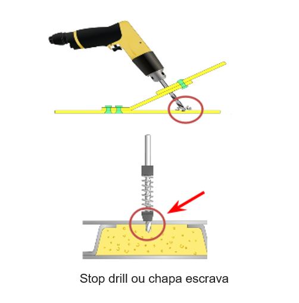
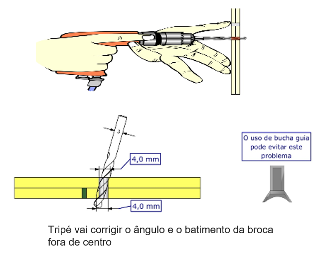

# Latecòere Training

O projeto Latecòere training foi desenvolvido durante e disciplina de Interação 
Humano Computador (IHC) ministrada pelo professor Giuliano Bertoti. Este projeto
é fruto de uma parceria entre a Latecòere e a Fatec(SJC) para o desenvolvimento
de uma aplicação web baseada em realidade virtual e/ou realidade aumentada para 
o treinamento de preparação de peças estruturais aeronáuticas. 

| Dados |  |
| ------ | ------ |
| Curso | Análise e Desenvolvimento de Sistemas (ADS) |
| Turma | 3 ADS A |
| Professor| Giuliano Bertoti|
| Equipe | Natália Cardoso Gonçalves|

# Introdução

O treinamento e a capacitação utilizando ambientes virtuais 3D podem prover
diversos benefícios em relação às abordagens tradicionais, dentre eles:
- redução do custo de treinamento
- redução do risco para o treinando
- repetibilidade das simulações
- facilidade para consultas

# Problema
Atualmente, a Latecòere utiliza apenas slides e apostilas para realizar a 
capacitação de sua mão de obra e está em busca de soluções que utilizem a abordagem
de realidade virtual e/ou realidade aumentada como ferramenta de auxílio ao instrutor.

Como proposta, foram apresentadas duas situações problemas envolvendo o processo
de furação em suas peças. As equipes devem propor soluções que atendam a pelo menos
uma dessas situações.

## Problema 1

Caso não seja utilizado o *stop drill* para garantir a profundidade do furo. A 
broca pode avançar e acabar atingido o revestimento imediatamente posterior a 
superfície do furo, provocando danos superfíciais ou mesmo a inviabilidade da 
peça, caso seja transpassada.

## Problema 2

O tripé deverá ser utilizado para garantir a retiliniedade do furo. Do contrário, 
os furos poderão ficar ovalizados ou mesmo fora de suas tolerâncias de fabricação, 
invalidando o uso da peça. 

## Critérios de avaliação
- Facilidade de instalação e uso pelos intrutores e treinandos;
- Adaptabilidade para outras situações problema;
- Custo para a implementação da solução;

# Proposta

